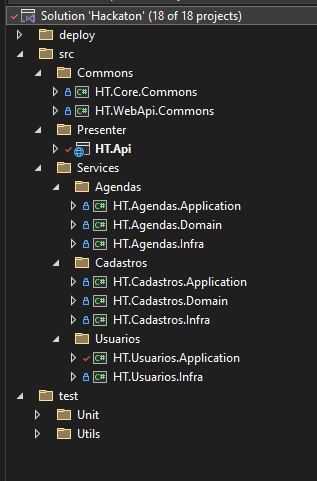
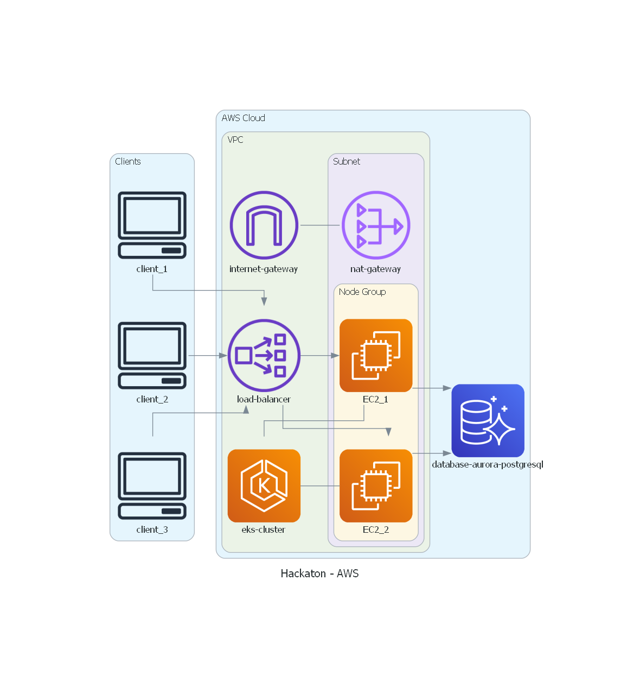
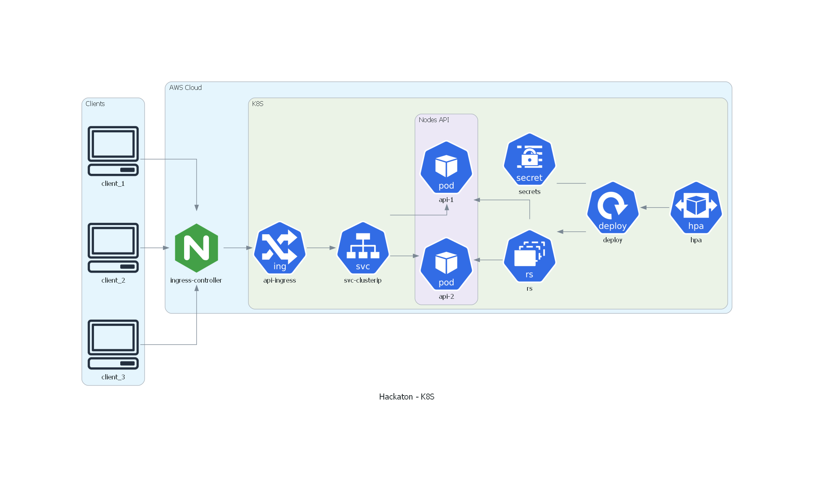

# Introdução :spiral_notepad:
Este projeto foi desenvolvido para atender à atividade proposta no Hackathon da Pós-Graduação em Arquitetura de Software. O objetivo é aplicar os conceitos aprendidos ao longo do curso e cumprir todos os requisitos especificados neste [documento](docs/requisitos_hackaton/Hackathon_SOAT.pdf).

# Tecnologias utilizadas :computer:
- .NET 8.0
  - ASP.NET Web API
  - Entity Framework Core
- PostgreSQL
- Docker
- Kubernetes
- AWS

# Arquitetura :triangular_ruler:
## Patterns utilizados
- Monolito
- Clean Architecture
- Domain Validations
- Repository Pattern
- Unit Of Work Pattern
- Testes unitários

## Introdução :mag:
Foi desenvolvido um monolito modular para organizar claramente os contextos delimitados. A implementação foi estruturada em três pastas principais:
- `Presenter`: Camada responsável por expor os serviços da aplicação. Ela recebe as requisições HTTP, valida os dados de entrada, injeta as dependências necessárias para a camada de aplicação e retorna os dados de saída ao solicitante.
- `Services`: Contém os serviços da aplicação organizados por contextos delimitados. Cada contexto possui seu próprio núcleo (com as camadas de aplicação e domínio) e infraestrutura.
- `Commons`: Centraliza os elementos compartilhados entre os diferentes módulos, incluindo objetos de domínio e serviços de infraestrutura que podem ser utilizados por mais de um contexto delimitado.


## Estrutura do projeto :hammer:
Todos os 3 microsserviços seguem o mesmo padrão. Para a explicação, apresentamos como base o microsserviço de **Pagamento**.

 </br>

## Clean Architecture :o:
 </br>

Cada serviço possui o seu core e sua camada de infraestrutura.

- `src`
    - `Services.*.Domain:` Projetos referentes à camada **Enterprise Business Rules** da Clean Architecture. Aqui é onde reside o domínio da aplicação, com as regras de negócio puras, sem dependências de bibliotecas ou frameworks externos. Esta camada expõe interfaces que serão implementadas nas camadas externas, seguindo o princípio de Inversão de Dependência.

    - `Services.*.Infra:` Nesta camada, o padrão Repository atua como um Gateway da camada **Interface Adapters** da Clean Architecture, onde os Repositories chamam um DbContext do ORM (Entity Framework). Nesse contexto, o ORM é considerado parte da camada **Frameworks & Drivers** da Clean Architecture. Todas as regras de acesso a dados estão na camada mais externa. Se for necessário alterar a forma de acesso aos dados, basta implementar uma nova classe baseada na interface existente e utilizar a nova implementação da camada **Frameworks & Drivers**.

    - `Services.*.Application:` Projetos referentes à camada **Application Business Rules** da Clean Architecture. Aqui são implementados os casos de uso (UseCases) do sistema. Os UseCases recebem, via injeção de dependência, os Gateways (Repositories) e os utilizam conforme necessário, de acordo com as regras de negócio.

    - `Presenter:` Contém os Controllers da camada **Interface Adapters** da Clean Architecture. Esses Controllers são responsáveis por invocar os UseCases, fornecendo todas as dependências necessárias via injeção de dependência, como, por exemplo, os Gateways (Repositories). A instanciação dos Gateways é realizada utilizando o mecanismo de Injeção de Dependência nativo do .NET. Nesse contexto, a injeção de dependência do framework é parte da camada **Frameworks & Drivers** da Clean Architecture.

- `test`
    - `Unit:` Projetos com a implementação de testes unitários.

## Diagramas da Arquitetura :bar_chart:

### AWS


### K8S



# Como executar - AWS :rocket:
A seguir estão as instruções para executar o projeto

## Pré-requisitos :clipboard:
### 1. Configuração de Secrets no GitHub

Para garantir o funcionamento correto dos workflows, é necessário configurar as seguintes secrets no GitHub, com base nas credenciais das contas AWS Academy, Docker Hub e SonarCloud:
- AWS_ACCESS_KEY_ID
- AWS_SECRET_ACCESS_KEY
- AWS_SESSION_TOKEN
- AWS_REGION
- DOCKERHUB_TOKEN
- SONAR_TOKEN
- DATABASE_PASSWORD

### 2. Criação da Infraestrutura de Banco de Dados
Execute a GitHub Action para criar a infraestrutura de banco de dados. Para isso, ajuste o arquivo [variables.tf](terraform/database/variables.tf) com as informações da AWS, crie um Pull Request com as alterações e faça o merge. Esse processo disparará o workflow responsável pela criação da infraestrutura de banco de dados.

### 3. Criação da Infraestrutura EKS e Configuração do appsettings.json
Após a criação da infraestrutura do banco de dados, o próximo passo é criar a infraestrutura do EKS e configurar a aplicação .NET.

- Atualize o arquivo [variables.tf](terraform/eks/variables.tf): insira as informações da AWS necessárias.
- Atualize o arquivo [secret.yaml](terraform/eks/kubernetes/secret.yaml): insira o conteúdo do arquivo `appsettings.json` da API .NET, substituindo o valor `{host}` pelo endereço do banco de dados Aurora PostgreSQL criado no passo anterior. Também insira as configurações para envio de email. O secret deve ser informado em Base64.

Exemplo de appsettings.json:
``` bash
{
  "Logging": {
    "LogLevel": {
      "Default": "Information",
      "Microsoft.AspNetCore": "Warning"
    }
  },
  "ConnectionStrings": {
    "DefaultConnection": "Host={host};Port=5432;Database=hackaton;Username=postgres;Password=acmeacme"
  },
  "IdentidadeSettings": {
    "Secret": "E076B751-88AC-4344-A931-88ABFD665916",
    "ExpirationHours": 2,
    "Issuer": "Hackaton",
    "ValidIn": "localhost"
  },
  "EmailSettings": {
    "Host": "sandbox.smtp.mailtrap.io",
    "Port": 587,
    "UserName": "",
    "Password": "",
    "FromEmail": "health_med@example.com",
    "FromName": "Health&Med",
    "EnableSsl": true
  }
}
```

### 4. Deploy da API
Com a infraestrutura pronta, a API estará disponível utilizando a última imagem publicada no DockerHub. Para realizar o deploy de uma nova versão da API, siga os passos:
1. Faça as alterações necessárias no código da API.
2. Crie um Pull Request e faça o merge.

O workflow será iniciado automaticamente, gerando uma nova imagem Docker, executando os testes unitários e publicando a imagem no DockerHub. Um `rollout restart` será aplicado automaticamente ao deployment no cluster EKS.


Para acessar o projeto no SonarCloud, [clique aqui](https://sonarcloud.io/summary/overall?id=5soat-acme_hackaton)


## Como utilizar :bulb:

Após toda a infraestrutura criada:
- Configurar **kubeconfig** com o comando
```
aws eks update-kubeconfig --region us-east-1 --name hackaton
```
- Com o comando abaixo buscar o link do LoadBalancer criado pelo Ingress NGINX Controller.
```
kubectl get service -n nginx-ingress
```

A URL de acesso será o conteúdo da coluna **EXTERNAL-IP** do serviço de tipo LoadBalancer.
A documentação estará disponível em: 
 - EXTERNAL-IP/swagger/index.html

# Utilização dos Endpoints :arrow_forward:
Os acessos aos endpoints são controlados por **[Json Web Token (JWT)](https://jwt.io/)**
Exemplos:
- Ao criar uma agenda, ela será automaticamente vinculada ao médico que está autenticado.
- Ao criar um agendamento, ele será associado ao paciente que está autenticado.
Essas informações são extraídas do token JWT utilizado na autenticação.

### Paciente
1. Pode-se criar o cadastro de um paciente em: `[POST] api/pacientes`

### Médico
1. Pode-se criar o cadastro de um médico em: `[POST] api/medicos`
2. Pode-se consultar os médicos disponíveis em: `[GET] api/medicos`

### Login
1. Pode-se efetuar o login em: `[POST] api/usuarios/acessar`

### Agenda
1. Pode-se criar uma agenda(data/hora) para o médico em:: `[POST] api/agendas`
2. Pode-se remover uma agenda do médico em: `[DELETE] api/agendas/{id}`
3. Pode-se consultar as agendas disponíveis de um médico em: `[GET] api/agendas/medico/{medicoId}`

### Agendamento
1. Pode-se efetuar um agendamento para o paciente em: `[POST] api/agendamentos`

<br><br>

## **Pronto! Agora você já pode utilizar a API** :smile: